<div align="center">

# 🎮 Game Launcher & Performance Booster

[]()
[]()
[]()
[-FF4088?style=for-the-badge&logo=dagger&logoColor=white)]()
[]()
[]()

> **Ang pinaka-powerful na Android performance booster para sa mobile gaming — designed for non-root devices!**

---

## 👤 Developer

| | |
|---|---|
|  | **Willy Gailo** |
|  | [GitHub](https://github.com/willygailo) • [Facebook](https://www.facebook.com/https.willy.jr.carnasa.gailo2026.2027) |

---

## Screenshots

| | | |
|---|---|---|
| 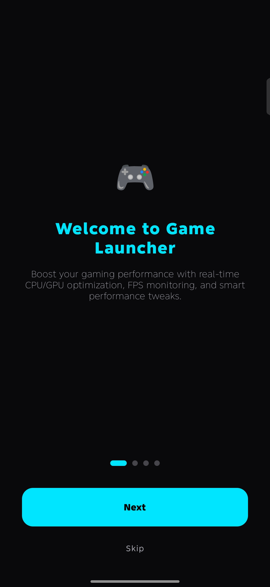 | 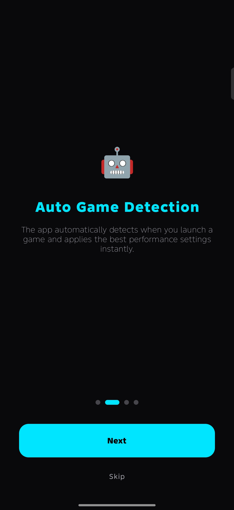 | 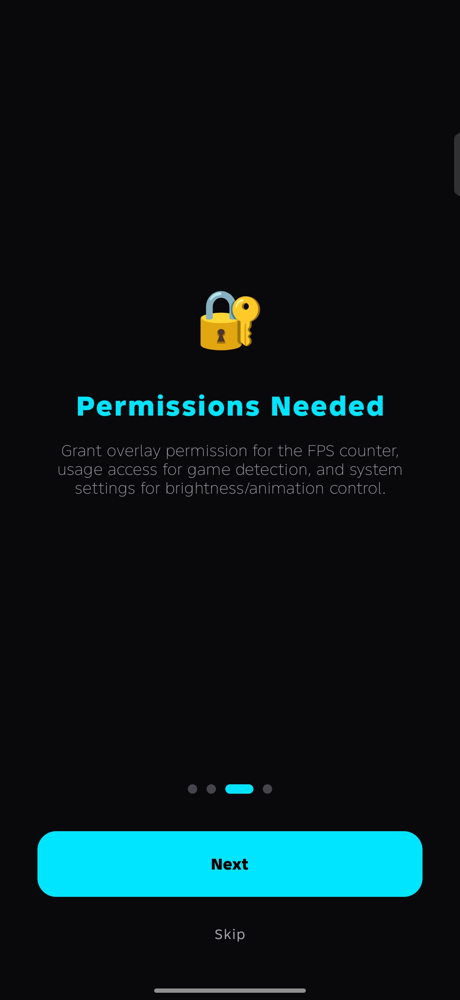 |
| 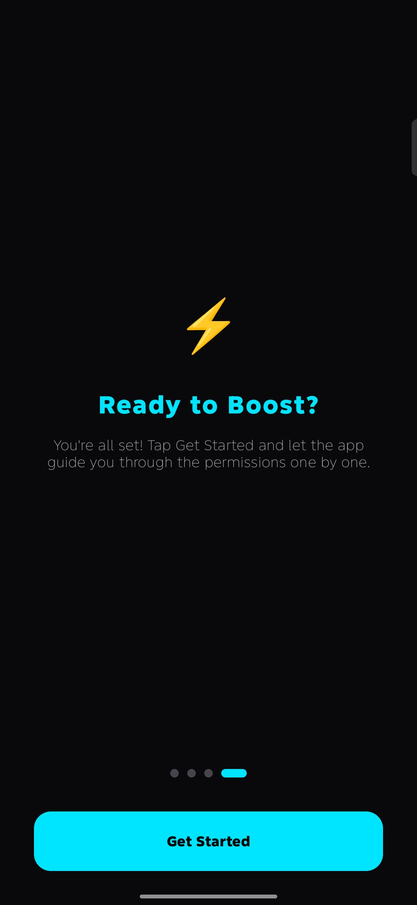 | 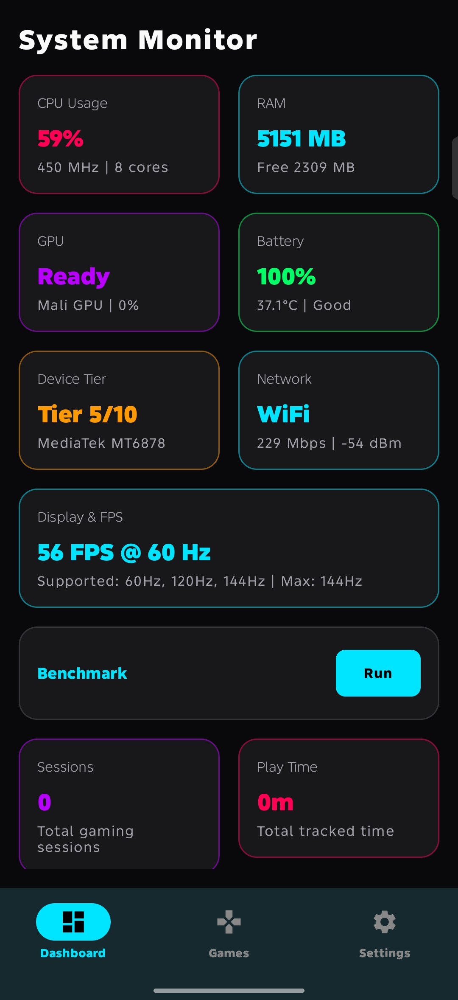 | 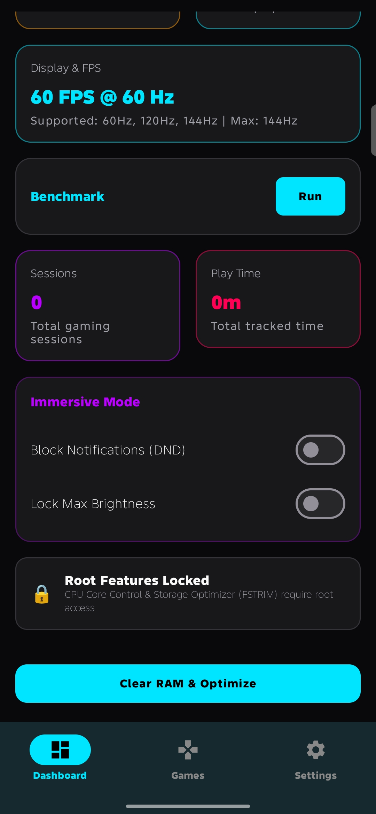 |
| 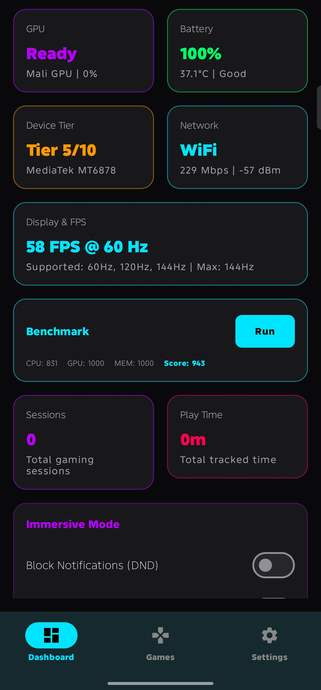 | 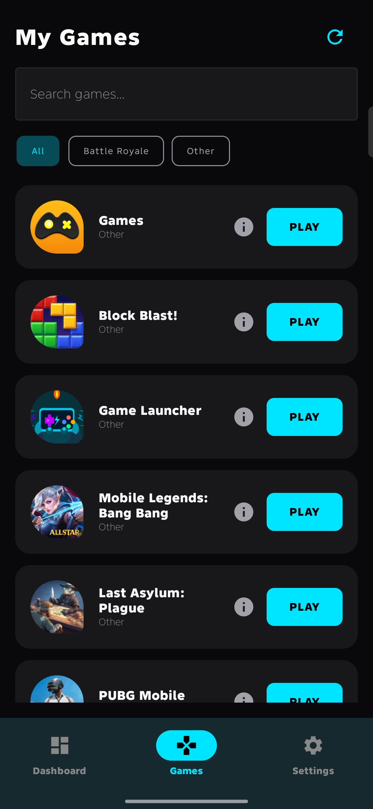 | 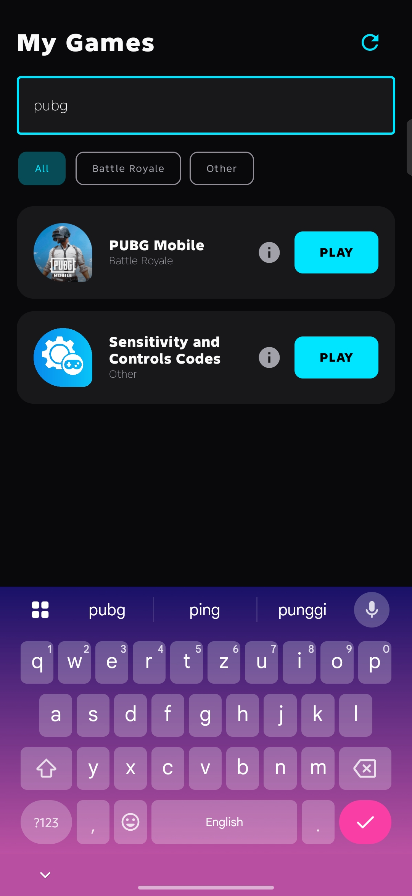 |
| 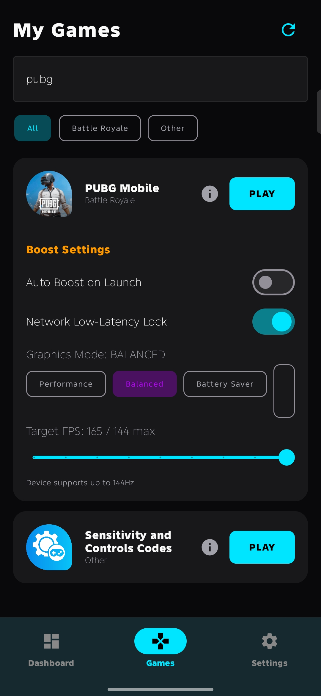 | 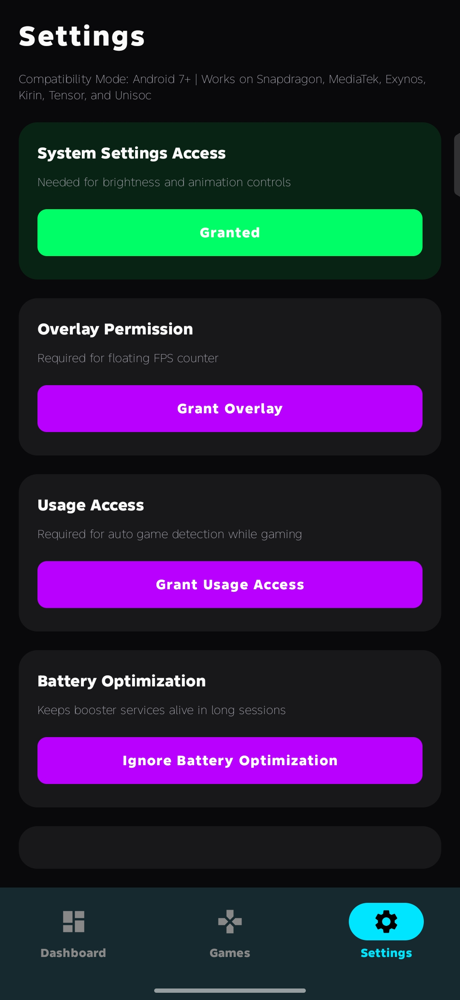 | 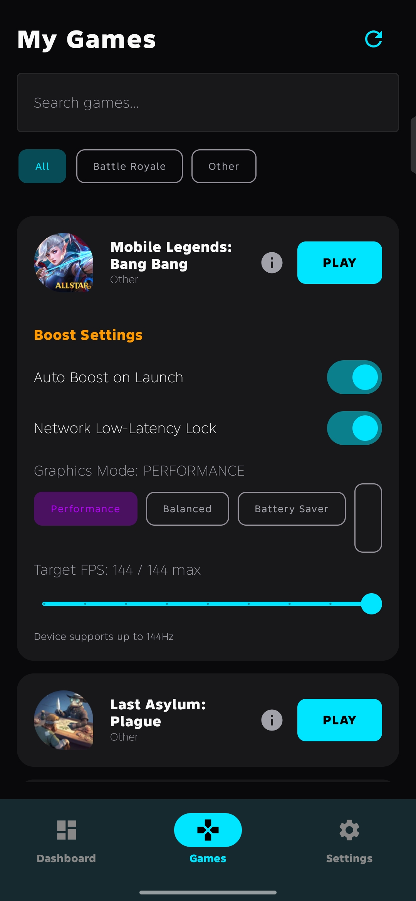 |

---

## ✨ Features

| Feature | Description | Status |
|---|---|---|
| **Real-time Monitoring** | CPU, RAM, GPU, battery, network, display stats | ✅ |
| **Floating FPS Counter** | Live FPS overlay habang naglalaro | ✅ |
| **Live Boost Notification** | Real-time FPS, Hz, network type & battery sa notification | ✅ |
| **Battery Saver Killer** | Auto-disable battery saver + Doze whitelist on boost start | ✅ 🆕 |
| **5G / WiFi Dual Stack** | 5G NR detection + WiFi 6E/7 + simultaneous WiFi+Data mode | ✅ 🆕 |
| **Max Hz Forcer** | Requests device maximum Hz through supported Settings APIs / ADB grants where OEM allows | ✅ 🆕 |
| **Jank Detection** | Real-time frame jank counter + drop alert in overlay | ✅ 🆕 |
| **Game Library** | Auto-detect ng lahat ng installed games | ✅ |
| **Per-Game Boosts** | Custom FPS capped to the real device panel, game cap, and thermal state | ✅ |
| **Immersive Controls** | DND mode (INTERRUPTION_FILTER_NONE), max brightness automation | ✅ |
| **Home Widget** | Quick Boost at Open buttons sa home screen | ✅ |
| **Quick Settings Tile** | Toggle booster sa notification panel | ✅ |
| **Game Detector** | Auto-boost pag nag-open ng game (UsageStatsManager) | ✅ |
| **Stats History** | Track ng play time per session (manual + auto) | ✅ |
| **RAM Optimizer** | Kill background apps instantly (non-root via ActivityManager) | ✅ |
| **Storage Optimizer** | Run fstrim para sa speed boost | ✅ |
| **Network Manager** | WiFi low-latency lock, 5G detection, dual-stack, quality score | ✅ |
| **ML Game Detection** | TensorFlow Lite 2.17 auto-classify games | ✅ |
| **Background Tasks** | WorkManager scheduled optimization | ✅ |
| **Permission UI** | Individual permission cards na may status indicator | ✅ |
| **Game Search & Filter** | Search bar + category filter chips (MOBA, FPS, RPG, etc.) | ✅ |
| **Gaming Session Recording** | Auto-record play time, FPS, battery drain, RAM per session | ✅ |
| **Session Stats Dashboard** | Total sessions & play time cards sa Dashboard | ✅ |
| **Game Details Screen** | Dedicated screen with session history, avg FPS, stats per game | ✅ |
| **Per-Game Graphics Mode** | Performance/Balanced/Battery Saver/Custom mode per game | ✅ |
| **Draggable FPS Overlay** | Drag the FPS counter anywhere on screen | ✅ |
| **Brightness Slider** | Adjustable brightness level (10%-100%) | ✅ |
| **CPU Core Control** | Toggle individual CPU cores on/off (root) | ✅ |
| **Benchmark Mode** | CPU/GPU/Memory benchmark with overall score | ✅ |
| **Dark/Light Theme** | Toggle between dark and light theme | ✅ |
| **Profile Import/Export** | Backup & restore per-game settings as JSON | ✅ |
| **Onboarding Walkthrough** | Guided 4-step intro sa unang open ng app | ✅ |

---

## ✅ Real-World Android Support Plan

This project now follows a legitimate Android-first boost model:

| Layer | Works on non-root? | What it can safely do |
|---|---:|---|
| **Basic App Mode** | ✅ | Wake lock, foreground boost service, ADPF hint session, FPS overlay, WiFi low-latency lock, RAM cleanup requests, game detection |
| **WRITE_SETTINGS Mode** | ✅ | Request `peak_refresh_rate` / `min_refresh_rate` and supported display settings after the user grants Modify System Settings |
| **ADB Advanced Mode** | ✅ | Uses one-time `WRITE_SECURE_SETTINGS` grant for secure settings such as animations, game driver opt-in, mobile data always-on, and OEM refresh keys |
| **Root Mode** | Optional | Applies kernel/sysfs/vendor props only when root is actually available and granted |

The app plans FPS/Hz from the real device, not a fixed number. It detects supported panel modes, current thermal status, game max FPS metadata, and per-game settings, then chooses a safe target such as `60`, `90`, `120`, `144`, `165`, or `240` only when the device really exposes that mode.

Important reality check: non-root Android apps cannot force another game engine to render above its own FPS cap, cannot bypass OEM thermal throttling, and cannot write protected kernel nodes. Game Launcher Pro requests every legal Android-side optimization it can, then reports limited states instead of pretending a locked setting succeeded.

SDK path is already set for local builds:

```properties
sdk.dir=/home/willygailo/Documents/Game_Launcher_Pro/android-sdk
```

ADB advanced unlock command:

```bash
adb shell pm grant com.gamelauncher.app android.permission.WRITE_SECURE_SETTINGS
```

### 🆕 v3.2.2: "Device-Planned FPS/Hz" & SDK 36 Upgrade

> Added smart target calculations using the new `DevicePerformancePlanner` which dynamically adjusts game FPS/Hz based on real-time device specs and thermal conditions. Added full support resources for Android 14 (API 34) and Android 16 (API 36).

| Feature | Description | Status |
|---|---|---|
| **DevicePerformancePlanner** | Dynamically plans optimal FPS and refresh rates using device panel modes and thermal headrooms. | 🆕 |
| **Android 14 & 16 Resources** | Added platform layout, localization assets, and complete SDK platform target support. | 🆕 |
| **Target Upgrade (v3.2.2)** | Build configuration bumped to versionCode 322 / versionName 3.2.2. | 🆕 |

---

### 🆕 v3.1.0: "Kapa Max" — Android 11-16 System Overrides

> Unlocked extreme Android tuning for non-root devices running Android 11 to 16. Includes GameManager priorities, ADPF thread harvesting, predictive thermal controls, and background app suppression.

| Feature | Description | Status |
|---|---|---|
| **GameManager Priority** | Forces `MODE_CONTENT` GameState on Android 12-16 to grant overlay & CPU priority. | 🆕 |
| **ADPF Thread Harvesting** | Dynamically harvests all child TIDs from `/proc/self/task` to inject into the ADPF Hint Session. | 🆕 |
| **AOT Speed Compilation** | Aggressive background ART compilation (`cmd package compile -m speed -f`) to remove stutter. | 🆕 |
| **Background Standby Lock** | Forces background apps into the `rare` standby bucket via `am set-standby-bucket`. | 🆕 |
| **Predictive Thermals** | Android 14+ `getThermalHeadroom()` forecast prevents hardware CPU throttling. | 🆕 |
| **Shizuku Command Shell** | Asynchronous coroutine shell execution for safe root-like commands. | 🆕 |

---

### v3.0.0: "Bare Metal" — TCP BBR & Zero Swappiness

> Bringing true kernel-level tuning to the masses. Unlocked deep network and memory controls for root users.

| Feature | Description | Status |
|---|---|---|
| **TCP BBR Congestion Control** | Replaces cubic with BBR for the lowest ping possible (`sysctl -w net.ipv4.tcp_congestion_control=bbr`) | 🆕 |
| **TCP Window Scaling** | Enhances data throughput for heavy network traffic | 🆕 |
| **Extreme Memory Swappiness** | Forces `vm.swappiness=0` to ensure Android NEVER swaps out your game memory | 🆕 |
| **Cache Dropping** | Clears pagecache, dentries, and inodes right before launch (`echo 3 > /proc/sys/vm/drop_caches`) | 🆕 |
| **Clean Restoration** | Returns all sysctl network and memory parameters back to normal after gaming | 🆕 |

---

### v2.4.0: "Nuclear Boost" — Battery Saver Kill + 5G + Max Hz

> The biggest performance update yet. Battery saver ang kalaban ng FPS — now it dies first.

| Feature | Description | Status |
|---|---|---|
| **BatterySaverManager** | Triple-layer battery saver killer: Settings.Global → PowerManager reflection → Root shell | 🆕 |
| **Adaptive Battery Disable** | Kills `adaptive_battery_management_enabled` so Android can't secretly re-enable saver mid-game | 🆕 |
| **Doze Whitelist** | `dumpsys deviceidle whitelist +<pkg>` — game process stays alive, no throttle | 🆕 |
| **5G NR Detection** | Real `NETWORK_TYPE_NR` detection via TelephonyManager (API 29+) + NetworkCapabilities (API 31+) | 🆕 |
| **WiFi 6E / WiFi 7 Detection** | `WifiInfo.wifiStandard` — shows "WiFi 4/5/6/6E/7" in overlay & notification | 🆕 |
| **WiFi + Data Dual Stack** | Both connections active simultaneously — best ping path selected automatically | 🆕 |
| **Network Quality Score (0-100)** | Real-time score based on bandwidth + type + congestion — shown in live notification | 🆕 |
| **Live Network StateFlows** | `networkType`, `is5G`, `wifiGenerationLabel`, `networkQualityScore` — reactive UI | 🆕 |
| **Max Hz Forcer (No Root)** | Writes `peak_refresh_rate` + `min_refresh_rate` via Settings.System — no root needed | 🆕 |
| **Jank Detection** | Frame interval > 2× target period counted as jank, displayed in overlay | 🆕 |
| **Rolling Avg FPS** | 2-second sliding window average (smoother than raw FPS for overlay readability) | 🆕 |
| **Frame Drop Alert** | `frameDropAlert` StateFlow fires when FPS falls below 85% of target | 🆕 |
| **Turbo SurfaceFlinger Props** | `debug.sf.disable_client_composition_cache`, `max_frame_buffer_acquired_buffers=3`, and more | 🆕 |
| **TCP Buffer Tuning (Root)** | Optimized `net.tcp.buffersize.5g/.lte/.wifi` via setprop — real latency reduction | 🆕 |
| **Root Battery Kill** | `persist.sys.power_save_mode=0`, `persist.sys.battery_saver=0` via setprop (root) | 🆕 |
| **Thermal Engine Suspend** | Stop `thermal-engine`/`thermald`/`mi_thermald` during session (root, optional toggle) | 🆕 |
| **Smart Boost Notification** | Shows game name + FPS + Hz + network type + battery % + saver status, live every 2s | 🆕 |
| **New Settings Toggles** | `disableBatterySaverOnBoost`, `networkDualStackEnabled`, `dozeWhitelistEnabled`, `forceMaxHzOnBoost`, `suspendThermalOnBoost` | 🆕 |
| **Mobile Data Always-On** | `mobile_data_always_on=1` during boost — prevents WiFi→data handoff ping spikes | 🆕 |

**Boost pipeline order (v2.4.0):**
```
1. Kill Battery Saver          ← NEW (happens first now)
2. Whitelist game from Doze    ← NEW
3. Start network monitoring    ← NEW (live StateFlows)
4. CPU/GPU/ADPF optimization
5. WiFi low-latency lock + mobile_data_always_on ← ENHANCED
6. Force max Hz + FPS lock     ← ENHANCED
7. Live notification updater (FPS | Hz | Network | Battery)
```

---

### v2.3.0: "Advanced Non-Root Boosts" Update

| Feature | Description | Status |
|---|---|---|
| **WRITE_SECURE_SETTINGS** | ADB-grantable permission to allow safe, deep system-level tweaks on non-root devices | 🆕 |
| **12 Touch Latency Overrides** | Pointer speed, touch report rate (1000Hz), scroll friction, velocity tracker, and input boost duration optimization | 🆕 |
| **6 Advanced System Toggles** | Kill animations, force GPU Game Driver, suspend background sync, mobile data priority, battery saver override, and disable location scans | 🆕 |
| **Adaptive Dashboard Banner** | Shows glowing neon blue `⚡ ADVANCED MODE` banner for ADB or green `🔓 ROOT MODE` badge for root when tweaks are active | 🆕 |
| **Interactive ADB Guide Card** | Easy-to-use clipboard command copy-paste helper card in Settings for non-technical users | 🆕 |

### v2.2.0: "Clean & Reactive" Architectural Overhaul

| Feature | Description | Status |
|---|---|---|
| **Domain Layer Use Cases** | Introduced `GetInstalledGamesUseCase` and `LaunchGameAndBoostUseCase` to isolate business and service orchestration logic | 🆕 |
| **UDF State Management** | Unified state tracking with `GamesUiState` in `GamesViewModel` for a single source of truth | 🆕 |
| **Progressive Flow Game Scanner** | Refactored the scanner to use Kotlin `Flow` for real-time progress updates and incremental game list populating | 🆕 |
| **Robust Unit Testing** | Added unit tests for Use Cases and ViewModels using JUnit4, Mockito, and Truth with a custom `FakeGamesRepository` | 🆕 |
| **UI Component Extraction** | Extracted `GameCard` and nested components into a separate, clean `com.gamelauncher.ui.components` package | 🆕 |

### v2.1.0: "Max Boost Real" Cyberpunk Update

| Feature | Description | Status |
|---|---|---|
| **Cyberpunk Dashboard** | New premium UI with animated arc gauges for CPU & GPU and linear progress bars for RAM & Battery | ✅ |
| **Max Refresh Rate Unlock** | Force maximum Hz output with custom FPS sliders up to device limits | ✅ |
| **Advanced Touch Latency Boost** | Extreme input latency reduction with pointer speed control | ✅ |
| **GPU Performance Tuning** | High-performance GPU rendering unlock and graphics parameter tweaks | ✅ |
| **RAM Aggressiveness Control** | Granular RAM management (LIGHT/NORMAL/AGGRESSIVE/EXTREME) | ✅ |
| **Per-Game Settings Panel** | Expandable config UI per game to toggle individual max boosts | ✅ |

### v2.0.0: Enhanced Gaming Experience

| Feature | Description | Status |
|---|---|---|
| **Game Session Recording** | Auto-record start/end time, FPS, battery drain, RAM per session | ✅ |
| **Game Search & Filter** | Real-time search bar + category filter chips | ✅ |
| **Draggable FPS Overlay** | Touch and drag the FPS counter anywhere on screen | ✅ |
| **Onboarding Walkthrough** | 4-page guided intro for first-time users | ✅ |
| **Per-Game Graphics Mode** | Choose Performance/Balanced/Battery Saver/Custom per game | ✅ |
| **Brightness Slider** | Adjustable 10%-100% brightness slider | ✅ |
| **Session Stats Dashboard** | Total sessions & play time tracking cards | ✅ |
| **Game Details Screen** | Session history, average FPS, per-game statistics | ✅ |
| **CPU Core Control** | Toggle individual cores on/off (root required) | ✅ |
| **Benchmark Mode** | Run CPU/GPU/Memory benchmark, compare scores | ✅ |
| **Dark/Light Theme Toggle** | Switch between dark and light theme in Settings | ✅ |
| **Profile Import/Export** | Backup/restore per-game settings as JSON files | ✅ |

### v1.8.0: Max FPS/Hz Unlock, SurfaceFlinger Boost, New SoCs & Games

| Feature | Description | Status |
|---|---|---|
| **SurfaceFlinger FPS Unlock** | `service call SurfaceFlinger 1035 i32 1` + 8 system props para sa max frame rate | 🆕 |
| **240Hz Display Support** | Auto-detect at lock hanggang 240Hz, dynamic FPS list per device | 🆕 |
| **ADPF v2 Integration** | Preferred update rate tracking, GPU pre-emption boost | 🆕 |
| **GPU Touch Boost** | Adreno/Mali/Immortalis specific touch-to-GPU feedback | 🆕 |
| **Faster Game Detection** | `/proc`-based detection (200ms vs 1500ms), boosted thread priority | 🆕 |
| **Dual FPS+Hz Overlay** | Shows both FPS at current refresh rate sa floating counter | 🆕 |
| **6 New Snapdragon SoCs** | 8 Elite Gen 2, 8 Gen 5, 7 Gen 1, 6 Gen 4/3, 4 Gen 2/1 | 🆕 |
| **9 New Dimensity SoCs** | 9500, 9400+, 8400, 8250, 7400, Helio G100/G84 | 🆕 |
| **Exynos 2600/2500/1580** | Samsung latest Exynos chipset support + ratings | 🆕 |
| **Tensor G6 Support** | Google Tensor G6/GS801 detection at optimization | 🆕 |
| **40+ New Games** | Delta Force, Overwatch Mobile, FragPunk, Solo Leveling, etc. | 🆕 |
| **Enhanced MediaTek Opt** | VPU governor, cpufreq power mode, CCI mode tuning | 🔧 |
| **Snapdragon CDSB Boost** | Compute CDSB governor, mem_latency, qti_cpu_boost module | 🔧 |
| **Touch Input Props** | `vendor.perf.input_boost.*` duration/frequency control | 🆕 |
| **CPU Governor Display** | Shows current governor name sa Dashboard CPU card | 🆕 |

### v1.7.2: Live Monitoring, DND Fix, Benchmark & Session Overhaul

| Feature | Description | Status |
|---|---|---|
| **Live FPS/Hz Notification** | GameBoosterService shows real-time FPS & Hz every 2s | 🆕 |
| **DND Fix** | `DndManager` now uses `INTERRUPTION_FILTER_NONE` (totally block notifs) | 🔧 |
| **Benchmark Update** | Real GPU test via Bitmap, CPU via sort/primes, memory via 512KB arrays | 🔧 |
| **Manual Session Recording** | Games tab now records GamingSession on PLAY | 🆕 |
| **Session Update Fix** | Uses session ID directly, not fragile `getLastSessionForGame` | 🔧 |
| **FpsMonitor Rewrite** | StateFlow instead of callbackFlow for reliable FPS | 🔧 |
| **Display & FPS Fix** | Real FPS & Hz now properly display on Dashboard | 🔧 |
| **Battery Exemption UI** | Shows "Granted" status, direct app settings fallback | 🔧 |
| **Non-Root GPU Force** | `forceGpuRendering()` + `setHighPerformanceMode()` | 🆕 |
| **Universal Chipset Detection** | Rockchip, Allwinner, Amlogic, Broadcom support + device fallback | 🆕 |

### v1.7.1: Performance Overhaul & Bug Fixes

| Feature | Description | Status |
|---|---|---|
| **Namespace Fix** | `com.gamelauncher.app` → `com.gamelauncher` (fixes ClassNotFoundException) | 🔧 |
| **Foreground Service Fix** | `dataSync` → `specialUse` with proper declaration (crash fix on Android 15+) | 🔧 |
| **Kapt → KSP Migration** | Hilt compiler via KSP, no more "falling back to 1.9" warning | 🔧 |
| **Wake Lock Support** | PowerManager partial wake lock for non-root devices | 🆕 |
| **Non-Root Optimizer** | `optimizeNonRoot()` — wake lock + thread priority + animations off | 🆕 |
| **Non-Root App Killer** | killBackgroundApps now uses ActivityManager for non-root | 🆕 |
| **All Deprecation Warnings Fixed** | NetworkManager, Theme, aaptOptions | 🔧 |
| **lockRefreshRate Cleanup** | Removed broken API 36 dead code | 🔧 |

</div>

---

<div align="center">

### Supported Games (200+ Titles)

</div>

| Game | Package | Max FPS |
|---|---|---|
| **PUBG Mobile** | `com.tencent.ig` | 165 |
| **PUBG Mobile (Regional)** | `com.pubg.krmobile`, `com.pubg.imobile`, `com.pubg.mobile` | 165 |
| **PUBG NEW STATE** | `com.krafton.gamepubg` | 165 |
| **Call of Duty Mobile** | `com.activision.callofduty.shooter` | 165 |
| **Call of Duty Mobile (Garena)** | `com.garena.game.codm` | 165 |
| **Call of Duty Warzone Mobile** | `com.activision.callofduty.warzone` | 165 |
| **Free Fire / Free Fire Max** | `com.garena.game.freefire` / `com.garena.game.freefiremobile` | 165 |
| **Mobile Legends: Bang Bang** | `com.mobile.legends` | 165 |
| **Genshin Impact** | `com.miHoYo.GenshinImpact` / `com.HoYoverse.GenshinImpact` | 165 |
| **Honkai: Star Rail** | `com.miHoYo.hsr` / `com.HoYoverse.hkrpg` | 165 |
| **Zenless Zone Zero** | `com.HoYoverse.zzz` | 165 |
| **Wuthering Waves** | `com.kuro.wutheringwaves` | 165 |
| **League of Legends: Wild Rift** | `com.riotgames.leagueofwildrift` | 165 |
| **Valorant Mobile** | `com.riotgames.valorant` | 165 |
| **Honor of Kings** | `com.tencent.tmgp.sgame` | 165 |
| **Fortnite** | `com.epicgames.fortnite` / `com.epicgames.fortnitemobile` | 165 |
| **Apex Legends Mobile** | `com.ea.gp.apexlegendsmobilefps` | 165 |
| **Roblox** | `com.roblox.client` | 165 |
| **Minecraft PE** | `com.mojang.minecraftpe` | 165 |
| **Squad Busters** | `com.supercell.squad` | 165 |
| **Marvel Snap** | `com.levelinfinite.marvelsnap` | 165 |
| **World of Tanks Blitz** | `com.wargaming.wot.blitz` | 165 |
| **Monster Hunter Now** | `com.capcom.monsterhunter` | 165 |
| **Dragon Ball Legends** | `com.bandainamco.dragonballlegends` | 165 |
| **eFootball PES** | `com.konami.pes` | 165 |
| **GTA: Definitive Edition** | `com.rockstargames.gtade` | 165 |
| **Delta Force Mobile** | `com.tencent.deltaforce` | 165 |
| **Overwatch Mobile** | `com.blizzard.overwatchmobile` | 165 |
| **FragPunk Mobile** | `com.netease.fragpunk` | 165 |
| **Solo Leveling: Arise** | `com.netmarble.solo_leveling` | 165 |
| **The First Descendant Mobile** | `com.nexon.firstdescendant` | 165 |
| **Naraka Bladepoint Mobile** | `com.netease.naraka` | 165 |
| **CrossFire Mobile** | `com.tencent.tmgp.cf` | 165 |
| **Standoff 2** | `com.axlebolt.standoff2` | 165 |
| **Critical Ops** | `com.criticalforce.studio.criticalops` | 165 |
| **Reverse: 1999** | `com.bluepoch.re1999` | 165 |
| **EA Sports FC 26 Mobile** | `com.ea.gp.fc26` | 165 |
| **eFootball 2026** | `com.konami.pes2026` | 165 |
| **NBA 2K26** | `com.t2ksports.nba2k26` | 165 |
| **Tekken Mobile** | `com.bandainamco.tekkenmobile` | 165 |

*And 170+ more titles — including regional variants and ML-detected games.*

---

<div align="center">

## 🛠️ Tech Stack

</div>

| Category | Technology |
|---|---|
| **UI Framework** | Jetpack Compose BOM 2024.06 + Material Design 3 |
| **Dependency Injection** | Hilt 2.52 via KSP (no Kapt) |
| **Local Storage** | Room 2.6.1 + DataStore Preferences |
| **Architecture** | MVVM + Repository Pattern + Domain Use Cases |
| **Build System** | Gradle 8.9 + AGP 8.5.2 + Kotlin DSL |
| **Language** | Kotlin 2.0.21 |
| **Annotation Processing** | KSP (Room + Hilt compiler) |
| **ML** | TensorFlow Lite 2.17 (game classification) |
| **Background Tasks** | WorkManager 2.10 |
| **Performance API** | ADPF v2 (Android 15+) + ADPF v1 (Android 12+) + optional root SurfaceFlinger requests |
| **Frame Analysis** | Choreographer — raw FPS (500ms) + 2s rolling avg + jank detection |
| **Network** | ConnectivityManager NetworkCallback + WifiInfo (WiFi 6E/7) + TelephonyManager (5G NR) |
| **Battery** | PowerManager + Settings.Global + root shell (triple-layer) |
| **Wake Lock** | PowerManager partial wake lock (non-root) |
| **Benchmark** | CPU (sort/primes), GPU (Bitmap operations), Memory (allocation) |
| **Chipset Detection** | Proc/cpuinfo + sysfs + Build.SOC_MODEL (Snapdragon/MTK/Exynos/Kirin/Unisoc/Tensor + others) |

---

<div align="center">

## 🚀 Quick Start

</div>

### Requirements

- Android Studio Ladybug (2024.2.1) or newer
- JDK 17+
- Android SDK 36 (Android 16)
- Test device: Android 10-16 (API 29-36)
- Gradle 8.9 (wrapper included)

### Build Instructions

```bash
# Clone
git clone https://github.com/willygailo/Game-Launcher.git
cd Game-Launcher

# Build debug APK (clean)
./gradlew clean assembleDebug

# Or incremental build
./gradlew assembleDebug

# APK location:
# app/build/outputs/apk/debug/app-debug.apk
```

### Install sa Device

```bash
# Enable USB Debugging:
# Settings > About Phone > Tap "Build Number" 7 times
# Settings > System > Developer Options > Enable USB Debugging

adb install app/build/outputs/apk/debug/app-debug.apk
```

### Run Tests

```bash
# Unit tests
./gradlew testDebugUnitTest

# Instrumentation tests (naka connect na device/emulator)
./gradlew connectedDebugAndroidTest
```

### Build Troubleshooting

| Issue | Fix |
|---|---|
| `Kapt doesn't support language version 2.0+` | Already fixed — Hilt uses KSP now |
| `ForegroundServiceTypeMismatch` | Already fixed — all services use `specialUse` with declarations |
| `ClassNotFoundException` on launch | Already fixed — namespace matches actual packages |

---

<div align="center">

## 🔐 Permissions Needed

</div>

| Permission | Purpose | How to Grant |
|---|---|---|
| `SYSTEM_ALERT_WINDOW` | FPS overlay display sa top ng games | App prompt |
| `FOREGROUND_SERVICE` + `FOREGROUND_SERVICE_SPECIAL_USE` | Background boosting services | Auto |
| `WRITE_SETTINGS` | Brightness at animation control | App prompt (manual on Android 16+) |
| `REQUEST_IGNORE_BATTERY_OPTIMIZATIONS` | Keep service alive during sessions | App prompt |
| `ACCESS_WIFI_STATE` / `CHANGE_WIFI_STATE` | WiFi low-latency lock | Auto |
| `ACCESS_NETWORK_STATE` / `CHANGE_NETWORK_STATE` | Dual WiFi+Data stack | Auto |
| `ACCESS_NOTIFICATIONS` | DND control during gaming | App prompt |
| `PACKAGE_USAGE_STATS` | Auto game detection (UsageStatsManager) | ADB (`appops`) or Settings → Special app access |
| `QUERY_ALL_PACKAGES` | Scan installed apps for games | Auto |
| `POST_NOTIFICATIONS` | Booster status notifications (Android 13+) | App prompt |
| `MODIFY_AUDIO_SETTINGS` | Volume optimization during gaming | Auto |
| `READ_PHONE_STATE` | 5G / LTE network type detection | ADB or App prompt |
| `WAKE_LOCK` | Prevent CPU sleep during gaming | Auto |

### ⚡ ADB Advanced Permissions (One-Time Setup — Unlocks Full Non-Root Mode)

```bash
# Grant on PC via USB — only needed once
adb shell pm grant com.gamelauncher.app android.permission.WRITE_SECURE_SETTINGS
adb shell pm grant com.gamelauncher.app android.permission.READ_PHONE_STATE
adb shell appops set com.gamelauncher.app GET_USAGE_STATS allow
```

> **Note (Android 16+ / API 36):**
> - `WRITE_SETTINGS` is now role-managed and **cannot** be granted via ADB.
>   Grant it manually: **Settings → Apps → Game Launcher → Modify system settings → Allow**
> - `PACKAGE_USAGE_STATS` is a special permission that requires `appops`, not `pm grant`.
>   If the Usage Access toggle is hidden on your device, use the ADB command above instead.
>
> After granting `WRITE_SECURE_SETTINGS`, the app automatically:
> - Kills battery saver on boost start
> - Disables animations
> - Forces game GPU driver
> - Enables mobile data always-on (WiFi + Data dual stack)
> - Disables background sync & location scanning during gaming

---

<div align="center">

## 📱 Supported Chipsets

</div>

| Manufacturer | Series | Status |
|---|---|---|
| **Qualcomm** | Snapdragon 8 Elite Gen 2, 8 Elite, 8 Gen 1/2/3/4/5, 7+ Gen 2/3, 7 Gen 1/3, 7s Gen 2, 6 Gen 1/3/4, 4 Gen 1/2, all SD models | ✅ |
| **MediaTek** | Dimensity 9500/9400+/9400/9300+/9300/9200+/9200/9000/8400/8300+/8300/8250/8200/8100/8025/7400/7350/7300/7250/7200/7050/7030, Helio G100/G99/G96/G95/G91/G88/G85/G84/G80/G70/G36/G35/G25 | ✅ |
| **Samsung** | Exynos 2600/2500/2400/2200/2100/1580/1480/1380/1280/1080, Exynos W series | ✅ |
| **Huawei** | Kirin 9010/9000S/9000/8000/990, all Kirin models | ✅ |
| **Unisoc** | T820/T770/T765/T760/T7250/T620/T618/T616/T610/T606 | ✅ |
| **Google** | Tensor G6/G5/G4/G3/G2/G1 | ✅ |

*Smart auto-performance scaling — NOT permanent max lock to prevent overheating.*

### Android Versions

[]()
[]()
[]()
[]()
[]()
[]()
[]()

---

<div align="center">

## 🔓 Root vs Non-Root Features

> The app is **fully designed for non-root devices**. Core boost features work without root.
> Root users get additional low-level optimizations, but the core gaming boost experience is complete without it.

</div>

| Feature | Without Root | With Root |
|---|---|---|
| ADPF Performance Session (Android 12+) | ✅ | ✅ |
| Wake Lock (PowerManager) | ✅ | ✅ |
| Thread Priority Boost | ✅ | ✅ |
| FPS/Hz Monitoring + Jank Detection | ✅ | ✅ |
| Max Hz Force (Settings.System) | ✅ (WRITE_SETTINGS + OEM support) | ✅ |
| Performance Benchmark | ✅ | ✅ |
| Battery Saver Disable (Layer 1+2) | ✅ (WRITE_SECURE_SETTINGS via ADB) | ✅ |
| Battery Saver Disable (Layer 3 nuclear) | ❌ | ✅ |
| Doze Whitelist | ✅ (ADB / secure shell grant) | ✅ |
| Thermal Engine Suspend | ❌ | ✅ |
| 5G + WiFi Dual-Stack | ✅ | ✅ |
| WiFi Low-Latency Lock | ✅ | ✅ |
| Mobile Data Always-On (gaming) | ✅ (WRITE_SECURE_SETTINGS) | ✅ |
| Refresh Rate Lock | ✅ (via Settings when OEM allows) | ✅ (via sysfs/props when available) |
| Animation Speed Control | ✅ (via ADB/Secure Settings) | ✅ (via sysfs) |
| Memory Cleanup | ✅ (killBackgroundProcesses) | ✅ (kill + drop caches) |
| Touch Optimization | ✅ (12 overrides via ADB/Secure) | ✅ (20+ sysfs/props) |
| Storage Optimization | ✅ (cache cleanup) | ✅ (FSTRIM) |
| Game Session Recording | ✅ (manual + auto) | ✅ (manual + auto) |
| GPU Force Render | ✅ (via ADB/Secure Settings) | ✅ (via sysfs) |
| High Performance Mode | ✅ (via PowerManager) | ✅ (via kernel) |
| CPU Governor Control | ❌ | ✅ |
| CPU Core Control | ❌ | ✅ |
| GPU Governor Control | ❌ | ✅ |
| TCP Buffer Tuning | ❌ | ✅ |
| SoC-Specific Kernel Tweaks | ❌ | ✅ |
| FPS/Hz System Prop Lock | ❌ | ✅ |

*Root is optional — the app is designed to work great on non-root devices!*

---

<div align="center">

## 🔧 Troubleshooting

</div>

<details>
<summary><strong>Battery Saver keeps turning back on during gaming?</strong></summary>

The app now kills battery saver on 3 layers simultaneously. If it still comes back:

1. Grant `WRITE_SECURE_SETTINGS` via ADB (see above) — this is the most reliable non-root method
2. Enable **Battery → Unrestricted** for Game Launcher in Android settings
3. For root users: enable **Suspend Thermal Engine** in Settings to prevent power-saving triggers
4. Samsung devices: Go to **Settings → Battery → Power Saving** and disable "Turn on automatically"

</details>

<details>
<summary><strong>Usage Access toggle missing or can't enable?</strong></summary>

On Android 16+ (API 36), the Usage Access toggle may be hidden or unresponsive. Use ADB instead:

```bash
adb shell appops set com.gamelauncher.app GET_USAGE_STATS allow
```

To verify it's granted:
```bash
adb shell appops get com.gamelauncher.app GET_USAGE_STATS
# Should show: GET_USAGE_STATS: allow
```

If ADB is not available, try: **Settings → Apps → Special app access → Usage access → Game Launcher → Allow**

</details>

<details>
<summary><strong>5G shows as LTE in the overlay?</strong></summary>

1. Grant `READ_PHONE_STATE` permission: `adb shell pm grant com.gamelauncher.app android.permission.READ_PHONE_STATE`
2. Make sure your SIM and carrier plan actually supports 5G NR (not 5G icon with LTE fallback)
3. On Android 11 and below, 5G detection requires location permission — not requested by this app for privacy

</details>

<details>
<summary><strong>Why are some features marked as "unavailable" in the notification?</strong></summary>

Normal on non-root devices. Root-only features (CPU Governor, GPU kernel tuning, TCP buffer props, thermal engine control) are disabled. All non-root features are fully active.

</details>

<details>
<summary><strong>Max Brightness Not Working?</strong></summary>

1. Buksan ang **Settings** tab sa app
2. I-tap ang **Grant System Settings**
3. I-enable ang **Modify system settings** para sa Game Launcher

</details>

<details>
<summary><strong>FPS Overlay Not Showing?</strong></summary>

1. Go to **Settings → Apps → Game Launcher → Permissions**
2. I-enable ang **Display over other apps**
3. Restart ang app

</details>

<details>
<summary><strong>DND Not Working?</strong></summary>

1. Go to **Settings → Apps → Game Launcher → Notifications**
2. I-enable ang **Do Not Disturb access**
3. Grant permission sa popup dialog

</details>

<details>
<summary><strong>Booster Not Starting Automatically?</strong></summary>

1. Go to **Settings → Apps → Game Launcher**
2. Battery → **Unrestricted** (para di mapatay ng system)
3. Enable **Auto-Start** kung available sa device
4. Grant `REQUEST_IGNORE_BATTERY_OPTIMIZATIONS` sa app settings

</details>

---

<div align="center">

## 📂 Project Structure

</div>

```
app/src/main/java/com/gamelauncher/
├── core/              # Performance, Device, FPS/Jank, SoC, DND, Network, Touch, Thermals
│   ├── BatterySaverManager.kt     # 🆕 Triple-layer battery saver kill + Doze whitelist
│   ├── FPSManager.kt              # 🆕 Jank detection, rolling avg, max Hz forcer
│   ├── NetworkManager.kt          # 🆕 5G NR, WiFi 6E/7, dual-stack, quality score
│   ├── PerformanceManager.kt      # CPU/GPU/ADPF + mobile_data_always_on
│   ├── GameOptimizationCoordinator.kt  # Main orchestrator (now kills battery saver first)
│   ├── BenchmarkManager.kt        # CPU/GPU/Memory benchmark
│   ├── ProfileManager.kt          # Game profile import/export
│   └── ...
├── data/              # Database, Models, Repository
│   ├── local/         # Room Database & DAOs
│   ├── model/         # Data classes (GameModel, GamingSession, DeviceSpecs)
│   ├── preference/    # DataStore settings (theme, onboarding, toggles) 🆕 +5 new keys
│   └── repository/    # Data layer
├── domain/            # Domain Layer (Use Cases)
│   └── usecase/       # GetInstalledGamesUseCase, LaunchGameAndBoostUseCase
├── di/                # Hilt DI — AppModule 🆕 provides DisplayManager
├── ml/                # TensorFlow Lite Game Classifier
├── receivers/         # Broadcast Receivers (Boot, Package Changes)
├── services/          # Background Services
│   ├── GameBoosterService         # 🆕 Battery saver kill + network monitoring wired in
│   ├── GameDetectorService        # UsageStatsManager-based, session recording
│   ├── OverlayService             # Draggable FPS counter
│   └── GameBoosterTileService     # Quick Settings tile
├── ui/                # UI Components (Compose)
│   ├── components/    # Reusable UI components (GameCard, BoostToggleRow, MiniTag)
│   ├── dashboard/     # Dashboard w/ Device Tier, Network, FPS, Benchmark, CPU Core
│   ├── games/         # Games Library screen and search functionality
│   ├── onboarding/    # 4-step onboarding walkthrough
│   ├── settings/      # Settings w/ permissions, theme toggle, import/export
│   └── theme/         # App Theme & Colors (dark/light)
└── widgets/           # Home Screen Widget (Boost + Open buttons)
```

---

<div align="center">

## 🤝 Contributing

Contributions are welcome! Here's how:

1. Fork the repo
2. Create your feature branch: `git checkout -b feature/amazing-feature`
3. Follow existing code style (MVVM, Compose, Hilt patterns)
4. Make sure tests pass: `./gradlew testDebugUnitTest`
5. Commit: `git commit -m 'Add amazing feature'`
6. Push: `git push origin feature/amazing-feature`
7. Open a Pull Request

---

## 📥 Download

- [Latest Release: v3.2.2](https://github.com/willygailo/Game-Launcher/releases/tag/v3.2.2)
- Or build from source using the instructions above

---

## 📜 License

MIT License — see the [LICENSE](LICENSE) file for details.

---

## 🌟 Showcase

*Built with ❤️ for Filipino mobile gamers!*
*📍 Philippines 🇵🇭*

---

*Optimizing gaming performance one device at a time ⚡*

[](https://github.com/willygailo/Game-Launcher/stargazers)
[](https://github.com/willygailo/Game-Launcher/network/members)

</div>
