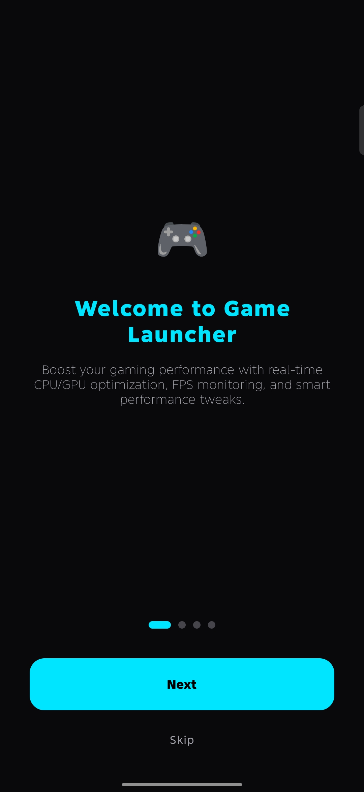
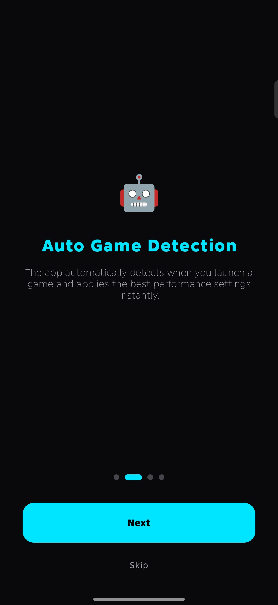
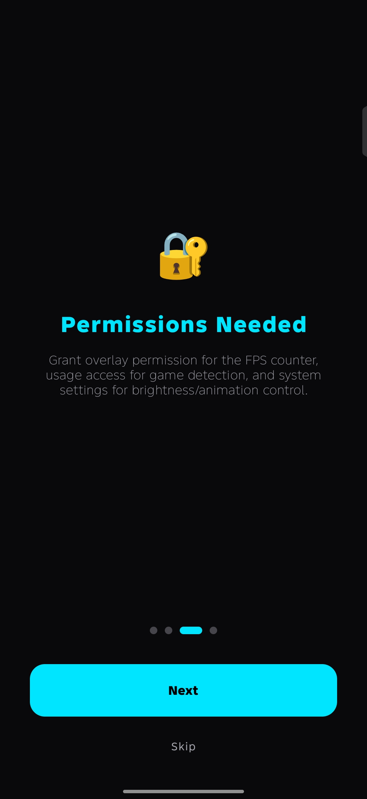
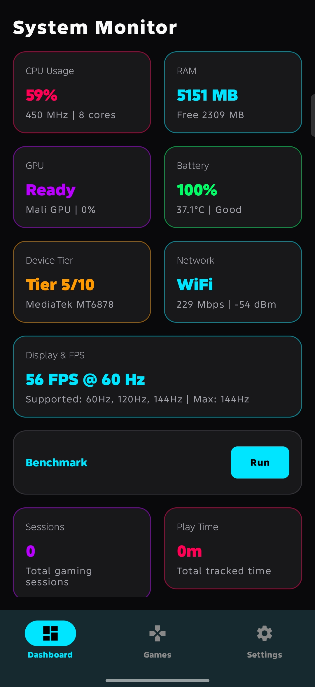
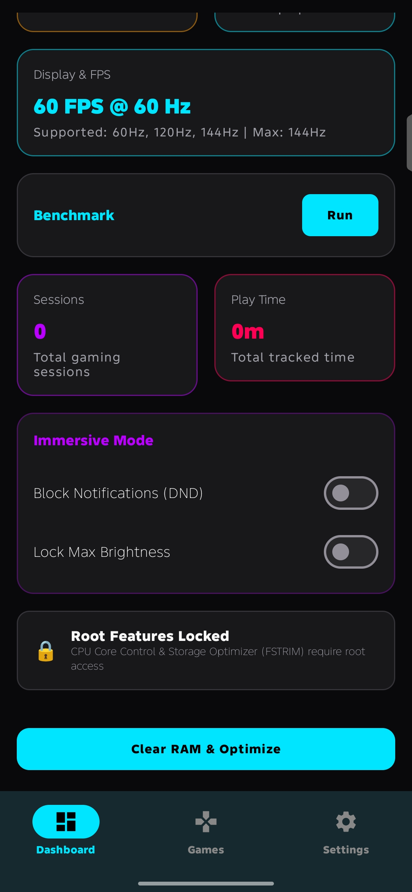
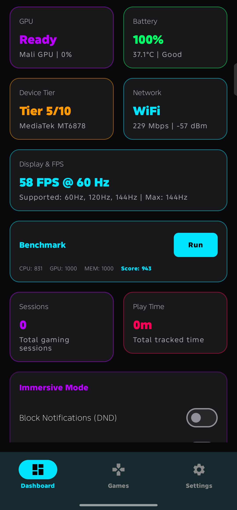

<div align="center">

# 🎮 Game Launcher & Performance Booster Pro

[]()
[]()
[]()
[-FF4088?style=for-the-badge&logo=dagger&logoColor=white)]()
[]()

**The ultimate Android gaming performance booster — designed for non-root & root devices alike!**

---

### 👤 Developer
**Willy Gailo**  
[GitHub](https://github.com/willygailo) • [Facebook Profile](https://www.facebook.com/https.willy.jr.carnasa.gailo2026.2027)

---

</div>

## 📸 Screenshots

| | | |
|---|---|---|
|  |  |  |
|  |  |  |

---

## 🆕 What's New in v3.5.3

- **🎮 Unified ROG Game Space Dashboard**: Consolidated Games, Tweaks, Network, Telemetry, and Readiness into a single high-performance dark HUD experience.
- **🎯 Dynamic Draggable & Collapsible Overlay**: Floating FPS/Hz bubble with custom touch drag motion, 1-tap **HIDE** collapse, and **STOP HUD** controls.
- **⚡ Advanced System Property (`setprop`) Tweaks**: Skia Vulkan rendering (`debug.hwui.renderer=skiavk`), SurfaceFlinger backpressure bypass, unsignaled buffer latching, and Realtime FIFO UI scheduling.
- **🤖 Android 13, 14, 15, and 16 Support**: Native `GameManager` performance mode binding, dynamic ADPF `updateTargetWorkDuration` frame pacing, Phantom Process Killer disable, and Thermal Headroom forecasting.
- **🔑 Automatic Shizuku Auto-Grant & ROM Audit**: Auto-grants `WRITE_SECURE_SETTINGS` on connection with live `ro.build.type` and `ro.debuggable` auditing.

---

## ⚡ Core Features

- **⚡ Performance Modes**: Instant switching and persistent profile management between **ECO** (Power Saver), **BALANCED** (Standard Boost), and **PRO** (Unrestricted Max Hardware Performance).
- **📱 Dynamic 144Hz+ Display Tuning**: Automatically discovers supported display modes via `Display.getSupportedModes()` to force peak refresh rates (60Hz to 144Hz+).
- **🔑 1-Tap Shizuku & Privilege Audit**: Granular 3-tier privilege classification (`NONE`, `SHIZUKU_ONLY`, `ROOT`) with 1-tap `WRITE_SECURE_SETTINGS` grant.
- **🔋 Bypass Charging (Non-Root)**: Pauses battery cell charging during intensive gaming sessions to eliminate heat throttling.
- **📊 Real-time Telemetry & Floating FPS Counter**: Live Choreographer frame pacing overlay with `/proc/stat` CPU usage, RAM gauge, and jank alerts.
- **🌐 Network & Low-Latency DNS Switcher**: One-tap Private DNS mode switching (Cloudflare, Google, AdGuard) with dual-stack 5G/WiFi network optimization.
- **🛠️ OEM Thermal Throttling Bypass**: Bypasses aggressive OS and OEM thermal throttling parameters via Shizuku ADB shell and system settings.

---

## 🛡️ Privilege Audit Matrix

| Privilege Mode | Setup Requirement | Capabilities & System Tweaks |
|---|---|---|
| **Basic (Non-Root)** | Default / No Permissions | Game priority boost, RAM optimization, Doze whitelist, network priority, floating FPS overlay |
| **Shizuku ADB Mode** | 1-Tap ADB / Shizuku Grant | `WRITE_SECURE_SETTINGS`, OEM refresh rate lock, 144Hz override, Bypass Charging, Thermal Throttling Bypass |
| **Root Mode** | Optional Superuser | Kernel sysfs CPU governor scaling (`schedutil`/`performance`), GPU acceleration, TCP BBR network tuning |

---

## 🚀 Quick Setup (ADB / Shizuku)

To grant privileged non-root capabilities via USB or Wireless ADB, run:

```bash
adb shell pm grant com.gamelauncher.app android.permission.WRITE_SECURE_SETTINGS
```

Or launch Shizuku and tap **Grant Shizuku Permission** inside the app Settings screen.

---

## 🛠️ Build from Source

Clone the repository and compile using Android Studio or Gradle wrapper:

```bash
git clone https://github.com/willygailo/Game-Launcher.git
cd Game-Launcher
./gradlew assembleRelease
```

The compiled APK will be available in `app/build/outputs/apk/release/app-release.apk`.

---

## 🏗️ Modular Architecture

Built with clean architecture patterns and Gradle submodules:

```
├── core/
│   ├── shizuku/       # Non-root ADB shell execution via Shizuku API & AIDL service
│   ├── settings/      # System & DataStore preferences abstraction
│   ├── device/        # Hardware specs, display mode query & OEM brand mapping
│   ├── permissions/   # Special app access permissions & status tracking
│   ├── database/      # Room AppDatabase & GameProfile entities
│   └── di/            # Dependency Injection Coroutine Dispatchers
├── feature/
│   ├── tweaks/        # System Performance Tweaks screen & ViewModel
│   ├── network/       # Private DNS switcher & socket ping prober
│   └── monitor/       # FPS gauge & telemetry overlay
└── app/               # Main application UI, Hilt setup & Navigation
```

---

## 📜 License & Links

- **Download Releases:** [v3.5.3 Latest Release](https://github.com/willygailo/Game-Launcher/releases)
- **License:** [MIT License](LICENSE)
- **Developer:** Willy Gailo (Philippines 🇵🇭)
