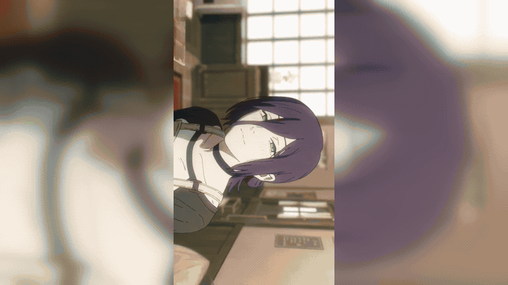

 
 

# ⚡ GAME LAUNCHER PRO ⚡
### 🚀 *Ultimate Android High-Refresh Gaming & Hardware Suite*

 

 

[📥 **Download Latest APK**](https://github.com/willygailo/Game-Launcher/releases/latest) • [✨ **Features**](#-features) • [🎮 **Supported Games**](#-supported-games) • [🚀 **Quick Start**](#-quick-start)

 

---

## 🌟 Overview

**Game Launcher PRO** is a lightweight, high-performance game booster designed for competitive mobile gaming on Android. It unlocks extreme display refresh rates (**90Hz – 185Hz**), optimizes touch response, and unlocks top-tier graphics presets without requiring root.

---

## ✨ Features

* 🔥 **Extreme Refresh Rates**: Uncaps 90Hz, 120Hz, 144Hz, 165Hz, and 185Hz display modes with zero 60Hz throttling.
* ⚡ **Native CPU Core Affinity & Scheduling**: Direct C++ CPU core pinning for game rendering threads to prevent frame drops.
* 🎮 **Unreal Engine & Unity Injectors**: Custom engine-level configuration injectors tailored for mobile competitive titles.
* 🎭 **Flagship Device Identity**: Spoofs device profiles (ROG Phone 9 Pro, RedMagic 10 Pro+, Galaxy S26 Ultra, etc.) across Snapdragon, Dimensity, and Apple chipsets.
* 🎯 **1000Hz Ultra Touch Polling**: Reduces touch latency and optimizes crosshair aiming response.
* 📊 **Live FPS & 1% Low HUD**: Real-time draggable overlay monitoring frame rates, frame jitter, RAM, and temperature.
* 🌐 **Low-Latency Turbo Network**: Wi-Fi QoS and TCP BBR gaming packet prioritization.
* 🛡️ **100% Non-Root Shizuku Engine**: Seamless auto-grant permissions and automated tweak restoration via Shizuku API.

---

## 🎮 Supported Games

| Game | Category | Max FPS Target |
| :--- | :---: | :---: |
| **PUBG Mobile / BGMI** | Battle Royale | 🔥 **185 FPS** |
| **Mobile Legends: Bang Bang** | MOBA | 🔥 **185 FPS** |
| **Call of Duty: Mobile & Warzone** | FPS | 🔥 **185 FPS** |
| **Free Fire & Free Fire MAX** | Battle Royale | 🔥 **185 FPS** |
| **Genshin Impact & Wuthering Waves** | Action RPG | ⚡ **120 FPS** |
| **Roblox & CarX Street** | Sandbox / Racing | 🔥 **185 FPS** |

---

## 🚀 Quick Start

1. **Download APK**: Get the latest [**`Game_Space.apk`**](https://github.com/willygailo/Game-Launcher/releases/latest).
2. **Start Shizuku**: Open [**Shizuku**](https://shizuku.rikka.app/) and start it via **Wireless Debugging** (Non-Root).
3. **Boost & Launch**: Open **Game Launcher PRO**, select your game, choose your target FPS, and tap **BOOST & LAUNCH**!

---

## 🤝 Developer

&nbsp;&nbsp;&nbsp;&nbsp;

 

⭐ **If you like this project, star it on GitHub!** ⭐

---

## 📄 License

This project is licensed under the [MIT License](LICENSE).
