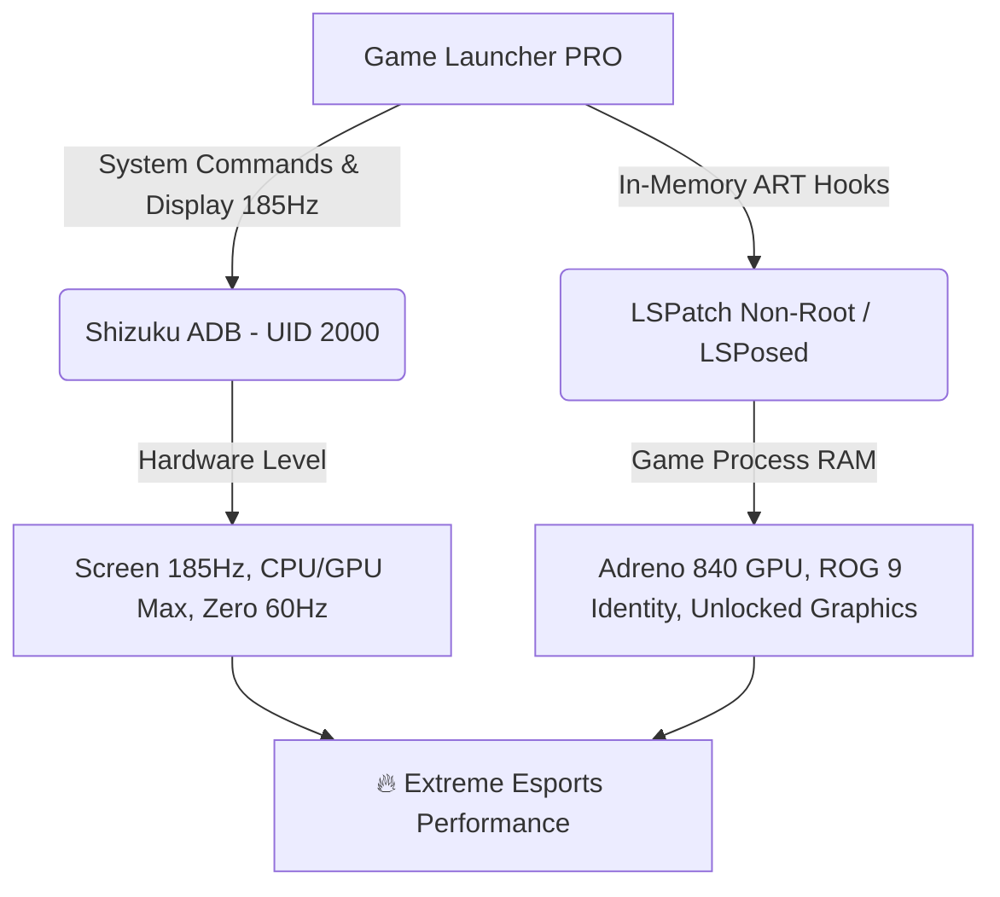

<div align="center">

# ⚡ GAME LAUNCHER PRO — ULTIMATE GAMING SUITE ⚡
### *Next-Gen 185 FPS Display Lock • In-Game ART-Level Hardware Spoofing • Dual Shizuku + LSPatch Engine*

<br/>

[](https://github.com/willygailo/Game-Launcher/releases/latest)
[-3DDC84?style=for-the-badge&logo=android&logoColor=white)](#-system-requirements)
[](#-dual-engine-lspatch--shizuku-combo)
[](#-privilege-layer)
[](#-building-from-source)
[](#-license)

<br/>

[📥 **Download Latest APK (v16.1.0-PRO)**](https://github.com/willygailo/Game-Launcher/releases/latest) • [✨ **Core Capabilities**](#-core-capabilities) • [🧬 **LSPatch Combo**](#-dual-engine-lspatch--shizuku-combo) • [🎮 **Supported Games**](#-supported-esports-titles) • [🏗️ **Architecture**](#-system-architecture) • [🚀 **Installation & Setup**](#-installation--setup)

<br/>

---

</div>

## 🌟 Executive Overview

**Game Launcher PRO** transforms your Android device into a dedicated, ultra-low-latency esports gaming powerhouse. Built upon the **Shizuku Privileged IPC Engine (UID 2000)** and a **Non-Root In-Memory ART LSPatch / LSPosed Bridge**, it unlocks hardware refresh rates up to **185 FPS**, eliminates thermal throttling governors, forces 1000Hz touch polling, and injects competitive in-game physics & graphics configurations—**100% Non-Root and Free**.

```
  ⚡ 185Hz Extreme ROG Mode  │  🎮 Adreno 840 GPU Spoofing  │  🧬 LSPatch Non-Root ART Hooks  │  🎯 1000Hz Ultra Touch Polling
```

---

## ✨ Core Capabilities

### ⚡ 1. High-Refresh Display Engine (90Hz – 185Hz Only)
* **Zero 60Hz Policy**: Completely eliminates 60Hz and 60 FPS caps. Enforces exclusive high-refresh modes: **90Hz, 120Hz, 144Hz, 165Hz, and 185Hz Extreme Max**.
* **SurfaceFlinger Synchronization**: Overrides hardware frame dispatching via `service call SurfaceFlinger 1035/1036`.
* **Android 14–16 Game Mode API**: Automates `cmd game mode performance` and sets target downscaling & framerate schedulers.
* **WindowManager Display Lock**: Prevents dynamic frame stepping and thermal drops during team fights.

### 🎮 2. Adreno 840 Flagship Hardware & GPU Spoofer
* **Flagship Device & GPU Profiles**:
  * 🔴 **ASUS ROG Phone 9 Pro** *(Snapdragon 8 Elite • Adreno 840 • 185Hz)*
  * 🌌 **Samsung Galaxy S26 Ultra** *(Snapdragon 8 Elite • Adreno 840 • 24GB RAM)*
  * ⚡ **REDMAGIC 10 Pro+** *(185Hz eSports Edition • Liquid Cooling Profile)*
  * ⚡ **Vivo iQOO 15 Pro** *(Dimensity 9400 • Immortalis-G925)*
  * 🐉 **Xiaomi 15 Ultra** *(Vulkan Ultra Gaming Profile)*
  * 🍏 **Apple A18 Pro / iPad Pro M4** *(High-tier graphics unlocking)*
* **OpenGL ES & Vulkan Interception**: Hooks `glGetString(GL_RENDERER/VENDOR/VERSION)` to report **`Adreno (TM) 840` / `Qualcomm`** for unlocking max graphics settings.
* **ProcFS & Memory Virtualization**: Masks `/proc/cpuinfo` and `/proc/meminfo` to bypass game-level hardware whitelists.

### 🧬 3. Dual-Engine: LSPatch (Non-Root) + LSPosed (Root) ART Hooks
* **True In-Process Masking**: The APK functions as a launcher AND an in-memory ART hook module.
* **Zero File Tampering**: When the module is active, device identity is intercepted directly in RAM, bypassing config file bans.
* **Live Configuration Sync**: Settings configured in the launcher are read in-game in real time through `SpoofPrefsProvider`.

### 🎯 4. Zero-Delay Touch & Input Acceleration
* **1000Hz Ultra Touch Polling**: Minimizes input lag and touch slop for pixel-precise crosshair control.
* **1000Hz Gyroscope Calibration**: Eliminates micro-jitter and stabilizes sensor sampling for competitive shooters.
* **AOT Speed Pre-compilation**: Compiles game DEX bytecode ahead-of-time to eliminate runtime stutter.

### 📡 5. Low-Jitter Gaming Network Optimizer
* **Wi-Fi Low-Latency Mode**: Locks Wi-Fi chips into low-jitter gaming state.
* **TCP Buffer Tuning**: Optimizes buffers (`tcp_default_init_rwnd`) for stable ping and reduced packet loss.
* **Ultra-Fast Gaming DNS**: Resolves connection routes with prioritized routing servers.

---

## 🧬 Dual-Engine: LSPatch + Shizuku Combo


```mermaid
graph TD
    A[Game Launcher PRO] -->|System Commands & Display 185Hz| B(Shizuku ADB - UID 2000)
    A -->|In-Memory ART Hooks| C(LSPatch Non-Root / LSPosed)
    B -->|Hardware Level| D[Screen 185Hz, CPU/GPU Max, Zero 60Hz]
    C -->|Game Process RAM| E[Adreno 840 GPU, ROG 9 Identity, Unlocked Graphics]
    D --> F[🔥 Extreme Esports Performance]
    E --> F
```

### 📱 How to Use LSPatch (100% Non-Root):
1. Open **Game Launcher PRO** → go to **Settings** → tap **🧬 Non-Root LSPatch Guide**.
2. Tap **Export Module APK** (automatically shares `Game_Space.apk` to LSPatch).
3. In **LSPatch**, tap **New Patch (+)**, choose your installed game, embed `Game Launcher PRO`, and install.
4. Launch the patched game—hardware spoofing and Adreno 840 GPU hooks will run **inside the game process without root**!

---

## 🎮 Supported Esports Titles

| Game Title | Category | Unlocked Capabilities |
| :--- | :---: | :--- |
| **PUBG Mobile / BGMI** *(All Versions)* | Battle Royale | 90/120/185 FPS `Active.sav` unlock, Multithreaded Vulkan, 1000Hz Gyro, Zero Recoil Physics |
| **Mobile Legends: Bang Bang** | MOBA | 120/165/185 FPS Ultra mode, Drone FOV scaling, Ultra Outline, Super Sampling |
| **Call of Duty: Mobile & Warzone** | FPS | 120/144/185 FPS Max, Real-time dynamic shadows, Zero deadzone touch, Sensitivity curve sync |
| **Free Fire & Free Fire MAX** | Battle Royale | 120/185 FPS Unlock, 1000Hz Touch polling, Aim response acceleration, Jitter reduction |
| **Genshin Impact & Wuthering Waves** | Action RPG | Max Graphics whitelist override, Uncapped 120 FPS, Vulkan backend routing |
| **Arena Breakout** | Tactical FPS | 120/144 FPS high-tier unlocked, Thermal throttle bypass, Audio footprint enhancer |
| **Blood Strike** | FPS | 120/165 FPS high refresh mode, Low latency touch, Memory compaction |
| **CarX Street** | Racing | Ultra graphic profile, 120/144/185 FPS uncapped renderer, Shading quality enhancement |
| **Farlight 84** | Hero Shooter | 120/165/185 FPS Solarland graphics engine, Recoil stabilization, Fast touch response |
| **Valorant Mobile / Project C** | Tactical FPS | 120/144/185 FPS UE4 CVars, 1000Hz touch & gyro tuning, Zero-delay crosshair stabilizer |
| **League of Legends: Wild Rift** | MOBA | 120 FPS Extreme preset, Dynamic resolution scaling off, Zero-delay input pipeline |
| **Standoff 2** | FPS | 120/144/165/185 FPS mode unlock, Fast touch sync, Jitter buffer reduction |
| **Supercell (Brawl Stars / Clash)** | Competitive | 120/144 FPS unlocked refresh rate, Low-latency touch response, Frame pacing stabilizer |
| **Roblox** | Sandbox | FastFlags 185 FPS scheduler, Vulkan rendering backend, Uncapped memory allocation |
| **Honor of Kings** | MOBA | 120/185 FPS Extreme mode, Ultra resolution preset, Input acceleration |

---

## 🏗️ System Architecture

```
Game-Launcher/
├── android/                             # Android Application Workspace
│   ├── app/
│   │   ├── src/main/aidl/              # Shizuku IUserService IPC definitions
│   │   ├── src/main/assets/shizuku/    # Bundled rish binary & dex runtime assets
│   │   ├── src/main/java/com/gamebooster/app/
│   │   │   ├── booster/                # Audio, GPU driver, and network latency engines
│   │   │   ├── config/                 # Per-game configuration patchers (PUBG, MLBB, CODM, etc.)
│   │   │   ├── core/                   # Threading executors, JS interface & profiles
│   │   │   ├── device/                 # Hardware & display capability detectors (90-185Hz)
│   │   │   ├── engine/                 # MasterOptimizationEnforcer & CommandExecutor
│   │   │   ├── games/                  # App scanning, registries, and launch helpers
│   │   │   ├── gamespace/              # Auto game monitoring, DND, and cache cleaner
│   │   │   ├── overlay/                # Floating HUD indicators & Crosshair overlay
│   │   │   ├── services/               # Background monitoring & boot receivers
│   │   │   ├── shizuku/                # Shizuku Binder communication & privileged file manager
│   │   │   ├── spoofer/                # 5-Layer HardwareMaskEngine & brand profiles (Adreno 840)
│   │   │   │   └── lsposed/             # LSPatch/LSPosed module: in-game ART hooks (Display, GL, Props)
│   │   │   ├── terminal/               # Cyber Terminal engine & script management
│   │   │   ├── tweaks/                 # System-level performance parameter controllers
│   │   │   └── ui/                     # Cyberpunk design system, fragments & adapters
│   │   ├── src/main/assets/xposed_init # LSPosed module entry point (legacy API 82)
│   │   ├── src/main/res/               # High-contrast cyber drawables, layouts & tokens
│   │   └── libs/XposedBridgeApi-82.jar # Vendored official Xposed API
│   └── build.gradle                    # Gradle Build Configuration (API 36 / Java 17)
├── tools/                               # Automated PC setup & Shizuku activation scripts
└── README.md                            # Documentation & Release Guide
```

---

## 🚀 Installation & Setup

### 📱 Method 1: On-Device Quick Start (No PC Needed)

1. **Download APK**:
   * Grab the latest [**`Game_Space.apk`**](https://github.com/willygailo/Game-Launcher/releases/latest) from Releases.
2. **Activate Shizuku**:
   * Install [**Shizuku**](https://shizuku.rikka.app/) from Google Play or GitHub.
   * Start Shizuku via **Wireless Debugging** in Android Developer Options.
3. **Launch & Boost**:
   * Open **Game Launcher PRO**, grant Shizuku privileged access when prompted.
   * Select your installed game, configure your optimization profile, and launch!

---

### 💻 Method 2: PC / ADB Automated Setup (One-Click)

Connect your Android device to your computer with **USB Debugging enabled**, then run:

```bash
# Run all-in-one setup (Installs APK, grants permissions, and activates Shizuku)
./tools/setup_device.sh
```

---

## 🛠️ Building from Source

### Prerequisites:
- **JDK 17** or **JDK 21** (`JAVA_HOME`).
- **Android SDK Build Tools** (API 36).

```bash
# 1. Clone repository
git clone https://github.com/willygailo/Game-Launcher.git
cd Game-Launcher/android

# 2. Build release and debug APKs
./gradlew clean assembleRelease assembleDebug
```

Binaries output path:
- **Release APK**: `android/app/build/outputs/apk/release/Game_Space.apk`
- **Debug APK**: `android/app/build/outputs/apk/debug/Game_Space_Debug.apk`

---

## 🔒 Security & Risk Transparency

> **Important:** Game Launcher PRO operates **zero-root via Shizuku** for system display control and ships an **in-memory LSPatch/LSPosed module** for game process masking. No file modifications are performed when the module is active. Use responsibly.

---

## 🤝 Connect & Developer

<div align="center">

[](https://github.com/willygailo)
&nbsp;&nbsp;
[](https://web.facebook.com/https.willy.jr.carnasa.gailo2026.2027)

⭐ **If you find this project helpful, please consider giving it a star on GitHub!** ⭐

</div>

---

## 📄 License

This project is licensed under the **MIT License** — see the [LICENSE](LICENSE) file for details.
