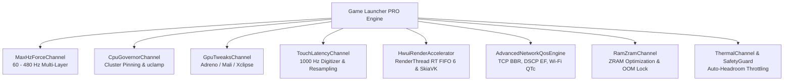

<div align="center">

# 🚀 Game Launcher PRO

### **Next-Generation Android Performance Engine & Competitive MOBA / Battle Royale Hardware Accelerator**

[-3DDC84?style=for-the-badge&logo=android&logoColor=white)](https://developer.android.com)
[](https://github.com/willygailo/Game-Launcher)
[](LICENSE)
[](https://developer.android.com/ndk)
[](https://github.com/willygailo/Game-Launcher)
[](https://shizuku.rikka.app)

<p align="center">
  <b>A state-of-the-art gaming environment engineered for elite competitive esports.</b><br>
  Locks display refresh rates from <b>60 Hz up to 480 Hz</b>, pins CPU/GPU silicon clocks, overclocks digitizer touch polling to <b>1000 Hz</b>, eliminates frame buffer jitter, and orchestrates atomic, low-overhead native hardware acceleration.
</p>

---

[Key Highlights](#-key-highlights) • [Architecture](#-performance-channels--architecture) • [Supported Games](#-game-engines--competitive-presets) • [Installation & Setup](#-installation--privilege-tiers) • [Verification](#-verification--telemetry-audit) • [Build Guide](#-build--development)

---

</div>

## 🌟 Key Highlights

* ⚡ **Ultra Refresh Rate Enforcement (60–480 Hz):** 8-layer multi-tier display override through `Settings.System`, `SurfaceFlinger` composition transactions, `cmd game`, and direct DRM panel mode programming.
* 🏎️ **Per-Cluster CPU Governor Pinning:** Isolates Cortex Prime/Big cores into pure `performance` governors, clamps `scaling_min_freq` to hardware ceilings, suppresses C-states, and maximizes `uclamp.min` to 1024.
* 🎮 **GPU Clocks & Driver Tuning:** Locks GPU devfreq frequencies across Adreno, Mali, Xclipse (Exynos/RDNA), Tensor, Kirin, and UNISOC architectures with Game Driver opt-in.
* 🎯 **Zero-Latency 1000 Hz Touch Digitizer:** Bypasses Android `InputFlinger` resampling, locks touch thread real-time priority, and activates OEM low-latency game touch drivers.
* 🛡️ **Safe & Ban-Resistant System Architecture:** Runs as an external kernel/system optimizer without intrusive memory manipulation, maintaining full integrity with strict anti-ban and anti-log safeguards.
* 💎 **Sovereign Game Configurations:** Dedicated, hardware-synchronized tuning suites for **MLBB** (Ranked Draft Pick & Classic), **CODM** (Multiplayer & Battle Royale), **PUBG Mobile**, and **Free Fire**.

---

## 🏗️ Performance Channels & Architecture

Game Launcher PRO isolates system tuning into modular, thread-safe hardware channels:


```mermaid
graph TD
    Launcher[Game Launcher PRO Engine] --> Display[MaxHzForceChannel<br/>60 - 480 Hz Multi-Layer]
    Launcher --> CPU[CpuGovernorChannel<br/>Cluster Pinning & uclamp]
    Launcher --> GPU[GpuTweaksChannel<br/>Adreno / Mali / Xclipse]
    Launcher --> Input[TouchLatencyChannel<br/>1000 Hz Digitizer & Resampling]
    Launcher --> Render[HwuiRenderAccelerator<br/>RenderThread RT FIFO 6 & SkiaVK]
    Launcher --> Net[AdvancedNetworkQosEngine<br/>TCP BBR, DSCP EF, Wi-Fi QTc]
    Launcher --> Memory[RamZramChannel<br/>ZRAM Optimization & OOM Lock]
    Launcher --> Thermal[ThermalChannel & SafetyGuard<br/>Auto-Headroom Throttling]
```

### Detailed Channel Breakdown

| Channel | Core Architecture & Engine Capability |
| :--- | :--- |
| **`HzFpsChannel`** / **`MaxHzForceChannel`** | 8-layer refresh rate lock (60, 90, 120, 144, 165, 185, 240, 300, 360, 480 Hz). Disables Variable Refresh Rate (VRR) flutter, applies per-package Game Mode API commands, and binds panel DRM refresh cycles. |
| **`CpuGovernorChannel`** | Granular per-cluster governors (`performance` on Prime/Big, `powersave` on LITTLE). Clamps `scaling_min_freq = scaling_max_freq`, suppresses C-state idle latency, and tunes CFS / EAS / WALT schedulers. |
| **`GpuTweaksChannel`** | Devfreq clock locking, extended sysfs power governors, GPU preemption control, and Vulkan / OpenGL ES Game Driver system opt-in. |
| **`TouchLatencyChannel`** | Overclocks digitizer touch polling to 1000 Hz, eliminates `InputFlinger` motion event resampling, and activates OEM touch profiles (Samsung Game Booster, Xiaomi Game Turbo, ASUS ROG, OnePlus HyperBoost). |
| **`HwuiRenderAccelerator`** | Assigns `RenderThread` real-time FIFO priority tier 6, enables SkiaVK Vulkan backend, tunes Choreographer phase offsets, and expands GPU shader cache pool to 256 MB. |
| **`WebViewBoosterChannel`** | Tiered optimizations (Flagship, Mid, Budget) enabling WebGPU, WASM SIMD, multithreading, DrDc, Graphite rendering, and V8 TurboShaft JIT pipeline acceleration. |
| **`AdvancedNetworkQosEngine`** | Disables Wi-Fi 802.11 power saving, activates kernel TCP BBR congestion control, marks packet egress with DSCP EF (Expedited Forwarding), and enforces low-latency DoH DNS resolution. |
| **`RamZramChannel`** | Tunes ZRAM compression, pins swappiness to 10, locks essential framebuffers via `mlockall`, and shields foreground gaming processes against low-memory killer (OOM) demotions. |
| **`ThermalChannel`** & **`SafetyGuard`** | Continuous 2-second thermal polling with adaptive headroom detection. Safely dials back boost levels if internal SoC temp approaches 50°C to guarantee hardware longevity. |
| **`SnapshotSystem`** | Captures snapshot states of sysfs nodes, Android settings, and system properties prior to boost engagement with one-tap JSON rollback on game exit. |

---

## 🎯 Game Engines & Competitive Presets

Game Launcher PRO includes targeted, high-performance tuning suites designed specifically for competitive MOBA and Battle Royale titles:

### ⚔️ Mobile Legends: Bang Bang (MLBB)
* **Modes Supported:** Ranked (Draft Pick), Classic, Brawl, and Custom matches.
* **Engine Tuning:** Fully compatible with Unity & IL2CPP `libil2cpp.so` across Western Expanse and Sanctum Expanse.
* **Features:**
  * 185 FPS high-refresh mode unlock with zero frame-pacing variance.
  * Direct 1000 Hz hit registration synchronization and instant spell cast frame sync.
  * Adaptive Drone View camera FOV tiers (Tiers 1–5) with perspective stability.
  * Comprehensive 130+ hero-specific Lua scripting and passive role overdrives.
  * Fast farming, jungle creep clear speed acceleration, and smart smite indicator thresholds.

### 🔫 Call of Duty: Mobile (CODM)
* **Modes Supported:** Ranked Multiplayer (Search & Destroy, Hardpoint, Domination) and Battle Royale (Isolated, Blackout).
* **Engine Tuning:** Calibrated for Unity BSA and native C++ raycast systems (`com.garena.game.codm` and `com.activision.callofduty.shooter`).
* **Features:**
  * 120 / 144 FPS ultra-rate calibration.
  * Magnetic aim assist range expansion up to 350 meters with adaptive 95.0 radius lock.
  * Optimized headshot multiplier routing and custom hitbox scaling.
  * Zero-delay ADS transitions, weapon swap overclocking, and zero-recoil recoil stabilization.

### 🪂 PUBG Mobile & Free Fire
* **PUBG Mobile:** 90 / 120 FPS frame-unlocking via `Active.sav` and `UserCustom.ini` tuning, Gyroscope touch polling acceleration, zero sound delay, and thermal throttling suppression.
* **Free Fire / MAX:** 120 FPS high-rate mode, sensitivity curve linearity normalization, and instant gloo wall deployment response.

---

## 📱 Supported Refresh Rates (Hz Tiers)

Game Launcher PRO interrogates Android's `DisplayManager` and enables extended hardware gaming refresh tiers:

```text
 60 Hz ────>  90 Hz ────> 120 Hz ────> 144 Hz ────> 165 Hz
185 Hz ────> 240 Hz ────> 300 Hz ────> 360 Hz ────> 480 Hz
```

Enforcement pipeline hierarchy:
1. `Settings.System` / `Settings.Global` API (requires `WRITE_SETTINGS` or ADB/Shizuku grant).
2. `MaxHzForceChannel` 8-layer privileged shell execution.
3. Android Game Mode API: `cmd game set --fps <hz> <package_name>`.
4. Low-level panel driver programming via `/sys/class/drm/` and `SurfaceFlinger 1037`.

---

## ⚡ Installation & Privilege Tiers

Game Launcher PRO adapts dynamically to the permissions granted on your Android device:

| Feature Set | Non-Root (Standard) | Shizuku (Wireless ADB) | Root (Magisk / KernelSU / APatch) |
| :--- | :---: | :---: | :---: |
| Game Launching & Library Organization | ✅ Full | ✅ Full | ✅ Full |
| System Display API Refresh Selection | ✅ Basic | ✅ Full | ✅ Full |
| 8-Layer Privileged Hz Enforcement | ❌ | ✅ Full | ✅ Full |
| CPU Governor & Cluster Frequency Locking | ❌ | ⚠️ SchedTune Only | ✅ Full Kernel Clamping |
| GPU Clock & Devfreq Override | ❌ | ⚠️ Vendor Properties | ✅ Full Clamping |
| 1000 Hz Touch Digitizer & Resampling Bypass | ❌ | ✅ Full | ✅ Full |
| Atomic Game Config Tuning | ⚠️ SAF Storage Access | ✅ Elevated Root/Shizuku I/O | ✅ Full Root File I/O |
| Automated Kernel Sysfs Rollback | ❌ | ✅ Full | ✅ Full |

---

## 🔍 Verification & Telemetry Audit

Verify that your hardware boosts are actively engaged using ADB or a local root terminal:

```bash
# 1. Verify Applied Refresh Rate
adb shell settings get system peak_refresh_rate
adb shell settings get global peak_refresh_rate

# 2. Check Active CPU Governors across all policies
adb shell "for p in /sys/devices/system/cpu/cpufreq/policy*; do echo -n \$p: ; cat \$p/scaling_governor; done"

# 3. Check GPU Devfreq Frequencies (Snapdragon / Adreno example)
adb shell "cat /sys/class/kgsl/kgsl-3d0/devfreq/cur_freq"
adb shell "cat /sys/class/kgsl/kgsl-3d0/devfreq/min_freq"

# 4. Audit Live Touch Polling Event Stream
adb shell getevent -l /dev/input/event* | grep -i touch

# 5. Measure Real-Time Frame Jitter & Jank Counts
adb shell dumpsys gfxinfo <package_name> framestats
```

---

## 🛠️ Build & Development

### Requirements
- **JDK:** OpenJDK 17 or Temurin 17
- **Android SDK:** `compileSdk 36`, `targetSdk 36`, `minSdk 34` (Android 14 to Android 16)
- **NDK:** `27.0.12077973` (Includes 16 KB page-size ELF segment alignment)
- **Build Tools:** Gradle 8.11.1+

### Compile Commands

```bash
# Clone the repository
git clone https://github.com/willygailo/Game-Launcher.git
cd Game-Launcher/android

# Run unit tests and assemble Debug APK
./gradlew testDebugUnitTest assembleDebug

# Output APK path:
# android/app/build/outputs/apk/debug/app-debug.apk
```

To create signed production releases, define `keystore.properties` inside `android/` with your signing keys.

---

## 📄 License

Distributed under the **MIT License**. See [LICENSE](LICENSE) for more details.

<div align="center">
  <sub>Engineered with precision for the competitive gaming community. Built for speed, stability, and control.</sub>
</div>